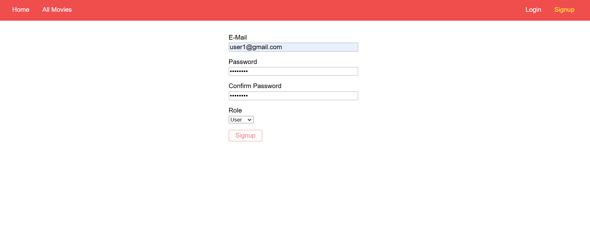
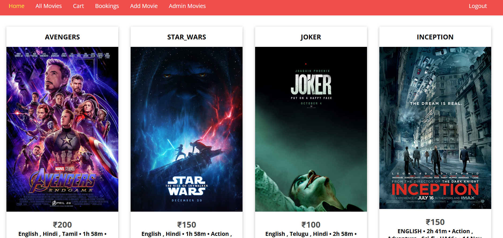
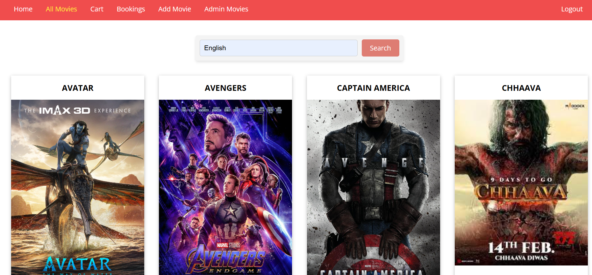
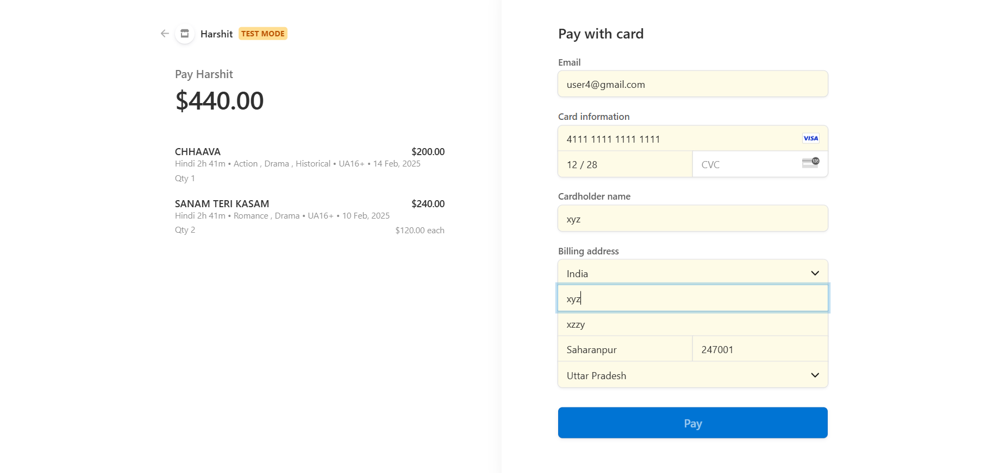
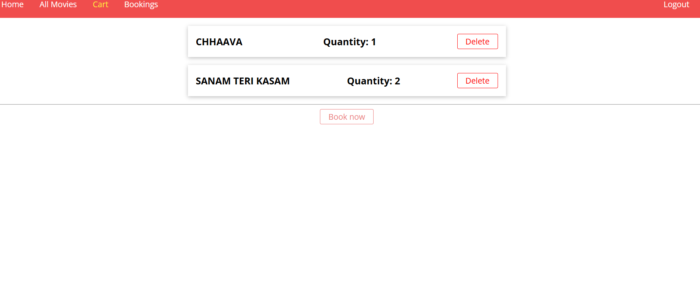
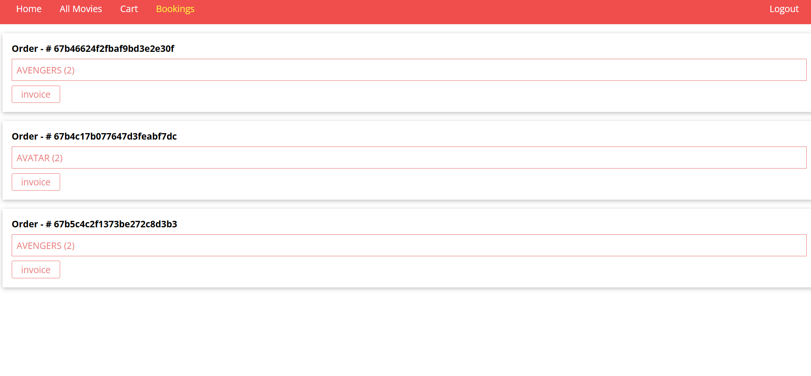
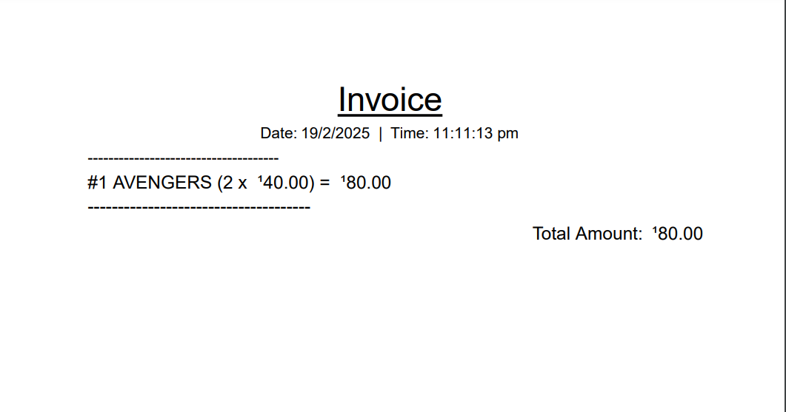
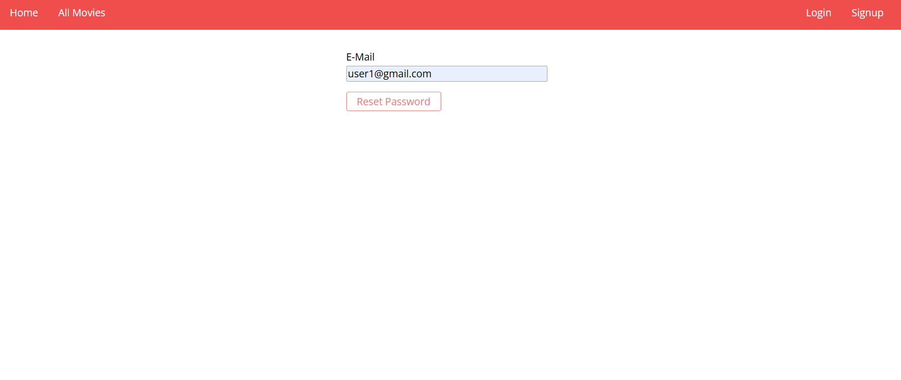

# 🎟️ Movie Ticket Booking System  
_A full-stack web application built with Node.js, Express, MongoDB, and EJS._

## 📌 Features  
- **Authentication**: Users can sign up, log in, and reset passwords using bcrypt.  
- **Movie Management (Admin)**: Admins can add, update, and delete movies, set and manage descriptions or pricing.  
- **Booking System**: Users can search for movies by title, language, or genre and book tickets.  
- **Cart**: Users can add or delete movies in the cart and book them later.  
- **Payment Integration**: Secure online payments for ticket booking.  
- **Invoice Generation**: Users receive an invoice after a successful payment.  
- **User Dashboard**: View past bookings in the form of invoices.  
- **Admin Dashboard**: Includes all user functionalities, along with movie management features.  
- **Upcoming Features**:  
  - 🎭 Dynamic Seat Selection  
  - 🏢 Manage Theaters  

---

## 🛠️ Tech Stack  
| Technology  | Usage |
|-------------|--------|
| **Node.js**  | Backend server |
| **Express.js**  | Web framework |
| **MongoDB**  | Database |
| **EJS**  | Templating engine |
| **bcrypt**  | Password hashing |
| **Multer**  | Image uploads |

---

## 🏗️ How It Works?  

### 🔑 **User Authentication**  
- Users and admins must sign up/log in to access the platform.  
- Passwords are securely hashed using bcrypt.  
- Users can choose their role (`User` or `Admin`) during sign-up.  

📸 **Screenshot:**  
  

---

### 🎬 **Admin Dashboard**  
- Admins can add movies with details like **title, description, genre, duration, and price**.  
- Admins can edit/delete movie listings.  

📸 **Screenshot:**  
  

---

### 🎟️ **Movie Browsing & Booking**  
- Users can **search movies** by title, genre, or language.  
- Users select movies, confirm booking, make a payment, and receive an invoice.  

📸 **Screenshot:**  
  
  

---

### 🛒 **Cart Functionality**  
- Users can **add movies to the cart** and book them later.  
- Movies in the cart can be removed before checkout.  

📸 **Screenshot:**  
  
    

---

### 💳 **Secure Payment & Invoice Generation**  
- Users complete bookings through a secure online payment system.  
- An invoice is generated upon successful booking.  

📸 **Screenshot:**  
  

---

### 🔄 **Forgot/Reset Password**  
- Users can reset their password via an email link.  

📸 **Screenshot:**  
  

---

## 🌐 View Website  
Click here: [Movie Ticket Booking System](https://movie-ticket-booking-system-d1in.onrender.com/)  

---

## 🚀 Future Integrations  
- 🎭 **Dynamic Seat Selection**  
- 🏢 **Multiple Theater Management**  
- 💳 **More Payment Options (UPI, Paytm, etc.)**  

---

## 📌 How to Run Locally  

```sh
# Clone the repository
git clone https://github.com/your-username/movie-ticket-booking.git

# Navigate to project directory
cd movie-ticket-booking

# Install dependencies
npm install

# Run the app
npm start
